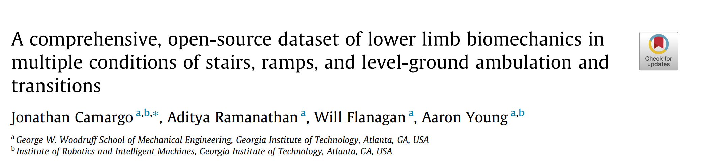
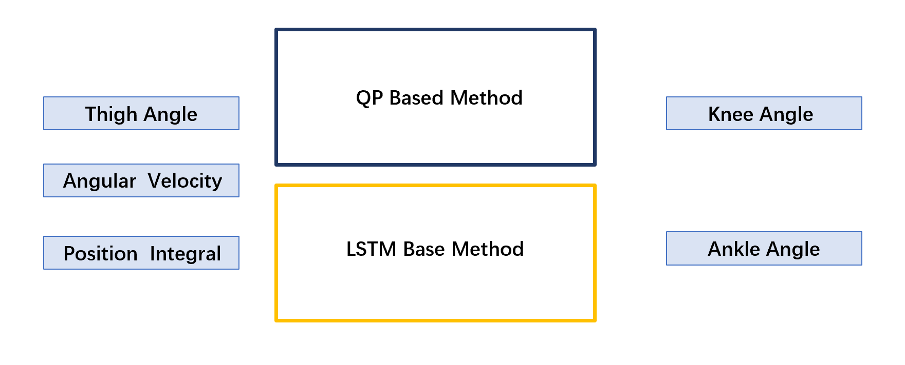
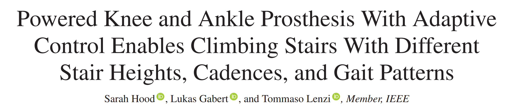
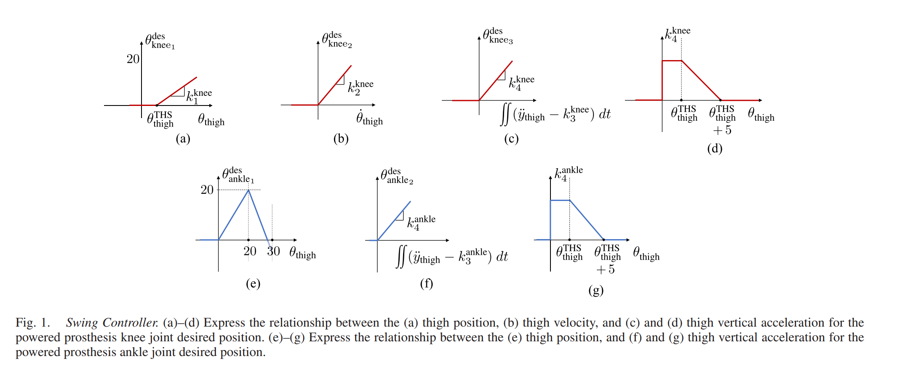

# 2022 Up-stair Gait Library

## Task 1:

Use IMU to collect the joint trajectories, hip and foot trajectories of different stair heights and stair distances when going up and down the stairs.

Preprocessing scripts for angular values using Python.(Gait division, Filter, Leg Length Calculation......)

### Reference 1:

Read the literature and summarize the process of data collection and processing.

## Task 2:

Using the optimized method to get the gait prediction model for stair climbing.

The prediction model is required to be concise enough.

### Reference 2:

Pay Attention to Fig1. It shows that the nonlinear virtual constraints of thigh angle and knee-ankle angle can be decomposed into a superposition of linear virtual constraints of thigh angle, angular velocity, position integral.