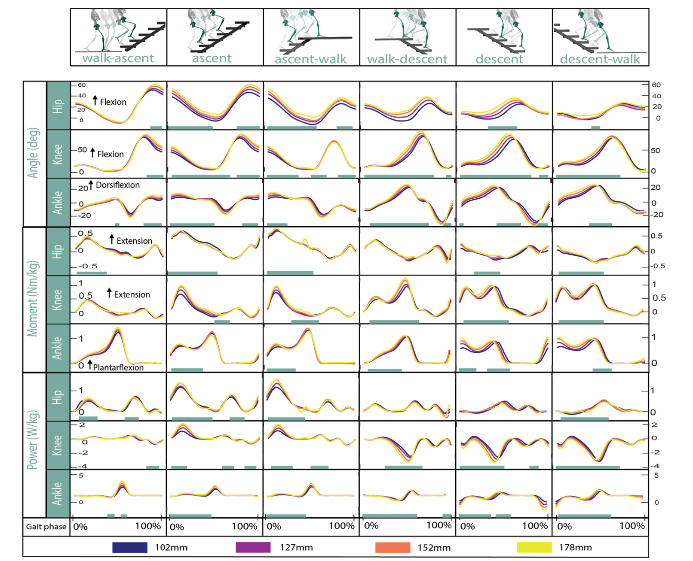

# 2022 Up-stair Gait Library

## Task 1:

Use IMU to collect the joint trajectories, hip and foot trajectories of different stair heights and stair distances when going up and down the stairs.

Preprocessing scripts for angular values using Python.(Gait division, Filter, Leg Length Calculation......)

### Standards:

----How to use wit sensor ?
----进入维特智能官网https://www.wit-motion.com/

点击CN进入中文版，在搜索框输入型号，本项目使用的是JY61P

----IMU: JY61P

【注意】

可以下载IMU的上位机，在Windows中使用。能够实时显示数据，但是只能匹配一个IMU，因此需要开发实时读取三个IMU数据的程序。新IMU需要在使用前用上位机进行配置和校准

1.运行前需先安装pyserial
2.教程地址：https://blog.csdn.net/Fred_1986/article/details/114415548
3.软件下载地址：https://download.csdn.net/download/Fred_1986/15602449
4.视频教程：https://www.bilibili.com/video/BV1bV411v7Bm/

----How to program using Wrapper Class?

----https://github.com/erwincoumans/motion_imitation/blob/d0e7b963c5a301984352d25a3ee0820266fa4218/motion_imitation/envs/env_builder.py#L79

----Programming skills: https://python3-cookbook.readthedocs.io/zh_CN/latest/chapters/p08_classes_and_objects.html

【注意】可以参考该程序的写法，使用类似继承的方式，利用Sensor类的对象描述每个传感器，再基于继承的方法给父类添加新的属性，形成HistoricSensorWrapper，具有历史缓冲区，可以比较方便进行数据滤波。

需要使用足跟的IMU进行积分，得到足端在空间中的运动轨迹

### Reference 1:

Read the literature and summarize the process of data collection and processing.

【注意】本任务旨在学习使用IMU，同时完善数据采集过程。该论文描述了国外公开数据集的数据采集过程，但是数据集中楼梯行走的数据相对较少。在使用IMU采集得到关节角度后可以和该论文中的相关数据图进行比较。

## Task 2:

Using the optimized method to get the gait prediction model for stair climbing.

The prediction model is required to be concise enough.

### Reference 2:

Pay Attention to Fig1. It shows that the nonlinear virtual constraints of thigh angle and knee-ankle angle can be decomposed into a superposition of linear virtual constraints of thigh angle, angular velocity, position integral.

【注意】该论文基于大腿传感器的角度，角速度，位置积分计算膝关节角度，实际上是将大腿角度与膝关节角度、踝关节角度的非线性虚拟约束解耦为其导数和积分与膝踝关节角度的线性虚拟约束，实现了更加准确，贴合使用者意图的相位估计。本任务希望对多意图量-相位估计关系进行建模，使用凸优化或者网络的方式，得到可以用于实际行走控制的预测模型。需要思考的是如何将复杂的函数关系简单的建模，像该论文中一样，通过简单的线性叠加就可以实现比较好的效果，便于工程使用。

## Related Work

附带一些代码供参考使用 code_wyx，见**说明**文档

